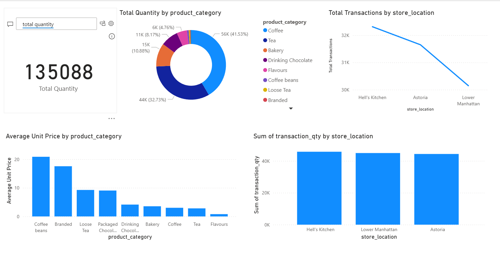

# Power BI - MySQL Transaction Dashboard

This project showcases a Power BI Dashboard built using a MySQL database containing coffee shop transaction data.

## 📊 Dashboard Highlights
- Total Revenue, Quantity, and Average Price KPIs
- Sales breakdown by Product Category & Type
- Time-series revenue trends
- Store location-wise revenue distribution
- Slicers for interactive filtering

## 🧩 Tech Stack
- Power BI
- MySQL
- DAX & Power Query
- Git & GitHub

## 🗃️ Dataset Columns
- `transaction_date`, `transaction_qty`, `store_id`, `product_category`, `product_type`, `unit_price`, etc.

## 🚀 How to Use
1. Clone the repo
2. Open the `.pbix` file in Power BI Desktop
3. Refresh or modify the data source as needed

---
## 📸 Dashboard Preview

